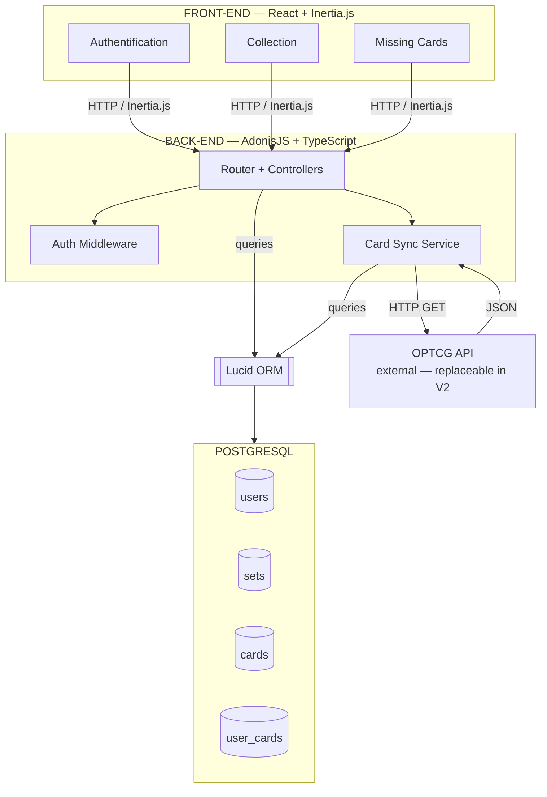
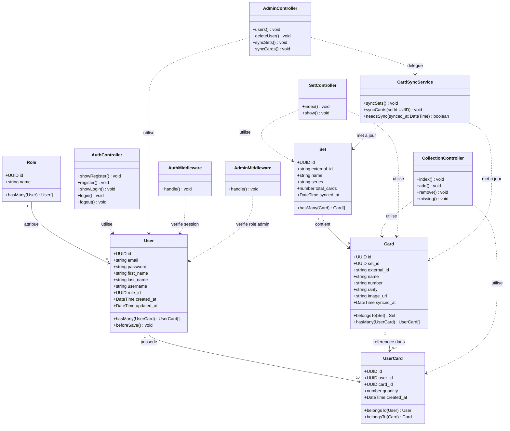
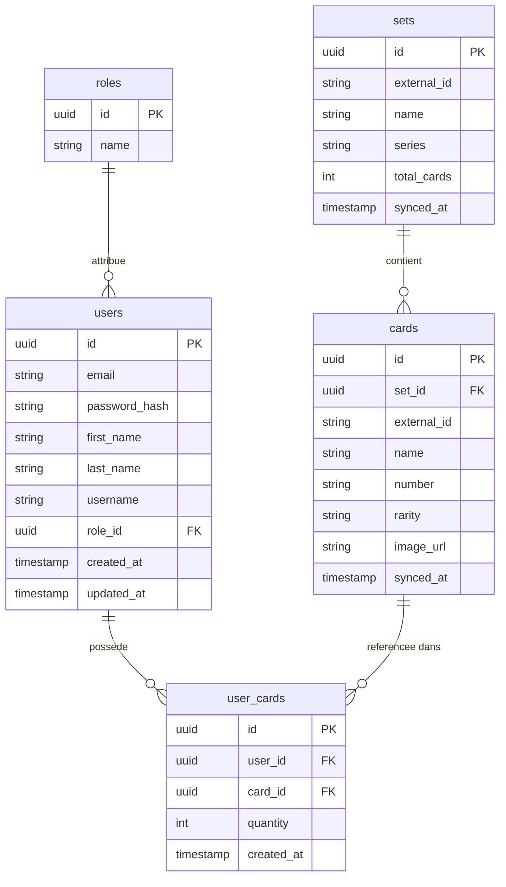
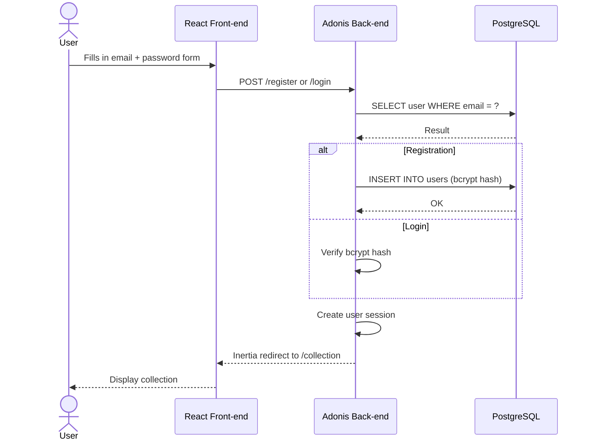
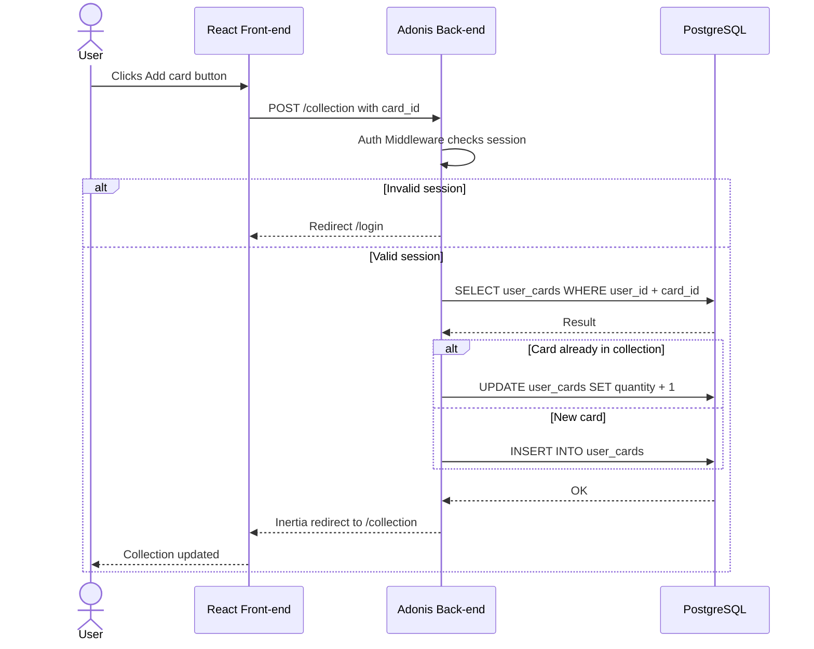
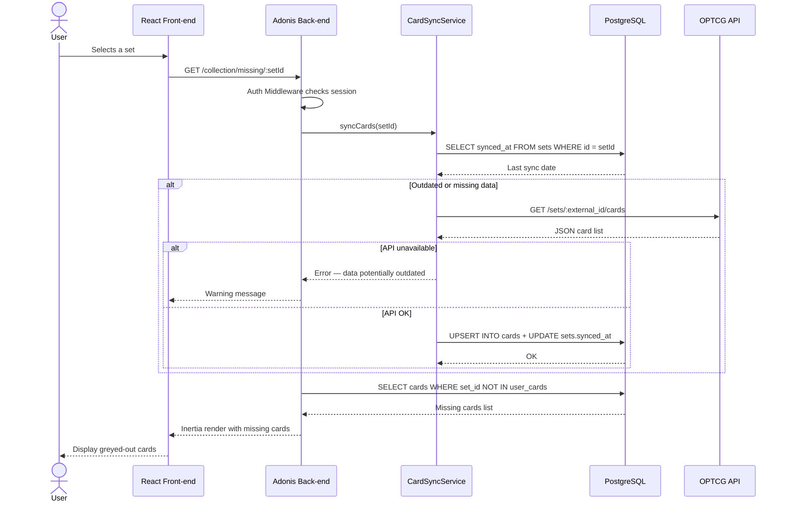
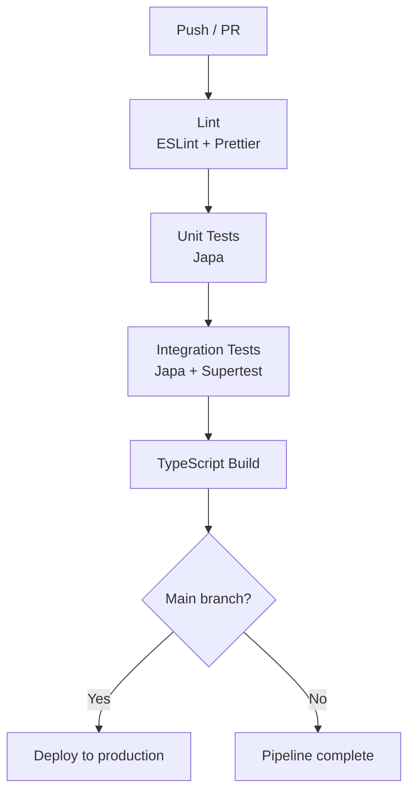

# TopCard — Technical Documentation MVP

> Web application for managing **One Piece Card Game** card collections.
> Solo development — Stack: AdonisJS · TypeScript · Inertia.js · React · PostgreSQL · Lucid ORM

---

## Table of Contents

1. [User Stories](#1-user-stories)
2. [Mockups](#2-mockups)
3. [System Architecture](#3-system-architecture)
4. [Components, Classes and Database Design](#4-components-classes-and-database-design)
5. [Sequence Diagrams](#5-sequence-diagrams)
6. [API Specifications](#6-api-specifications)
7. [SCM and QA](#7-scm-and-qa)
8. [Technical Justifications](#8-technical-justifications)

---

## 1. User Stories

> Prioritization: **MoSCoW** method (Must · Should · Could · Won't).

### User Roles

| Role | Description |
|------|-------------|
| Visitor | Non-authenticated user, limited access to public pages |
| Collector | Registered and authenticated user, access to their collection and tracking features |
| Admin | User with the `admin` role, access to administration and synchronization routes |

---

### Authentication

| ID | User Story | Priority |
|----|-----------|----------|
| AUTH-01 | As a visitor, I want to create an account with an email and password, so that I can manage my own collection. | Must Have |
| AUTH-02 | As a collector, I want to log in to my account, so that I can access my personal collection. | Must Have |
| AUTH-03 | As a collector, I want to log out, so that I can secure access to my account. | Must Have |
| AUTH-04 | As a visitor, I want to receive a clear error message if my credentials are incorrect, so that I can understand why my login failed. | Should Have |

### Collection Management

| ID | User Story | Priority |
|----|-----------|----------|
| COLL-01 | As a collector, I want to search for a card by name or number, so that I can find it quickly in the database. | Must Have |
| COLL-02 | As a collector, I want to add a card to my collection, so that I can mark it as owned. | Must Have |
| COLL-03 | As a collector, I want to specify the quantity of copies of a card, so that I can accurately track my duplicates. | Must Have |
| COLL-04 | As a collector, I want to remove a card from my collection, so that I can correct a mistake or update my inventory. | Must Have |
| COLL-05 | As a collector, I want to view my complete collection, so that I can have an overview of all my cards. | Must Have |
| COLL-06 | As a collector, I want to filter my collection by set, so that I can focus on a specific extension. | Should Have |

### Missing Cards

| ID | User Story | Priority |
|----|-----------|----------|
| MISS-01 | As a collector, I want to select a set, so that I can focus on the extension I want to complete. | Must Have |
| MISS-02 | As a collector, I want to see the list of cards I am missing from a set, so that I know which ones to look for. | Must Have |
| MISS-03 | As a collector, I want to see the completion percentage of a set, so that I can measure my progress. | Should Have |
| MISS-04 | As a collector, I want to export the list of missing cards, so that I can use it outside the application. | Could Have |

### External API Synchronization

| ID | User Story | Priority |
|----|-----------|----------|
| SYNC-01 | As a collector, I want the set and card data to be up to date via the external API, so that I have access to the latest official catalogue. | Must Have |
| SYNC-02 | As a collector, I want to receive a clear error message if data retrieval fails, so that I can understand the unavailability and retry later. | Should Have |

### Out of Scope V1 (Won't Have)

| ID | User Story | Reason for deferral |
|----|-----------|-----------------|
| OUT-01 | View card market prices | Deferred to V2 — requires a reliable pricing source |
| OUT-02 | Trade cards with other users | Deferred to V3 — requires social features and moderation |
| OUT-03 | View store event pages | Deferred to V2/V3 — depends on store partnerships |

### MoSCoW Summary

| Priority | Number of stories |
|----------|-------------------|
| Must Have | 11 |
| Should Have | 4 |
| Could Have | 1 |
| Won't Have (V1) | 3 |
| **Total** | **19** |

---

## 2. Mockups

### Screens

| Screen | Desktop | Mobile |
|-------|---------|--------|
| Login / Register page | `mockups/desktop/01_auth.png` | `mockups/mobile/01_auth.png` |
| Home page | `mockups/desktop/02_home.png` | `mockups/mobile/02_home.png` |
| Dashboard — My Collection | `mockups/desktop/03_collection.png` | `mockups/mobile/03_collection.png` |
| Card detail | `mockups/desktop/04_detail-card.png` | `mockups/mobile/04_detail-card.png` |
| Profile & Statistics | `mockups/desktop/05_profil&stats.png` | `mockups/mobile/05_profil&stats.png` |

> **Greying convention:** any card not owned by the user is displayed with reduced opacity and a grey overlay. Owned cards are displayed normally.

---

## 3. System Architecture

### High-Level Diagram



### Main Flow

`User > React (Inertia) > Router > [Auth Middleware | Card Sync Service] > Lucid ORM > PostgreSQL`

The Card Sync Service can additionally trigger an outbound call to the OPTCG API to refresh the catalogue before responding.

---

## 4. Components, Classes and Database Design

### 4.1 Models (Lucid ORM)

#### User

| Attribute | Type | Description |
|----------|------|-------------|
| id | uuid PK | Primary key |
| email | string | Unique email address |
| password | string | bcrypt hash |
| first_name | string | User's first name |
| last_name | string | User's last name |
| username | string | Unique username |
| role_id | uuid FK | Foreign key to Role (default: user) |
| created_at | DateTime | Creation date |
| updated_at | DateTime | Last update date |

Methods: `hasMany(UserCard)`, `belongsTo(Role)`, `beforeSave()` bcrypt hook

#### Role

| Attribute | Type | Description |
|----------|------|-------------|
| id | uuid PK | Primary key |
| name | string | Role name (admin, user, pro) |

Methods: `hasMany(User)`

---

#### Set

| Attribute | Type | Description |
|----------|------|-------------|
| id | uuid PK | Primary key |
| external_id | string | Identifier from OPTCG API |
| name | string | Set name |
| series | string | Parent series |
| total_cards | number | Total number of cards in the set |
| synced_at | DateTime | Last API synchronization date |

Methods: `hasMany(Card)`

#### Card

| Attribute | Type | Description |
|----------|------|-------------|
| id | uuid PK | Primary key |
| set_id | uuid FK | Foreign key to Set |
| external_id | string | Identifier from OPTCG API |
| name | string | Card name |
| number | string | Card number in the set |
| rarity | string | Rarity |
| image_url | string | Image URL (cached) |
| synced_at | DateTime | Last API synchronization date |

Methods: `belongsTo(Set)`, `hasMany(UserCard)`

#### UserCard

| Attribute | Type | Description |
|----------|------|-------------|
| id | uuid PK | Primary key |
| user_id | uuid FK | Foreign key to User |
| card_id | uuid FK | Foreign key to Card |
| quantity | number | Number of copies owned |
| created_at | DateTime | Date added |

Methods: `belongsTo(User)`, `belongsTo(Card)`

---

### 4.2 Controllers

| Controller | Method | Route | Description |
|------------|---------|-------|-------------|
| AuthController | `showRegister()` | GET /register | Display register form |
| AuthController | `register()` | POST /register | Create account |
| AuthController | `showLogin()` | GET /login | Display login form |
| AuthController | `login()` | POST /login | Authenticate via session |
| AuthController | `logout()` | POST /logout | Destroy session |
| CollectionController | `index()` | GET /collection | List the collection |
| CollectionController | `add()` | POST /collection | Add a card |
| CollectionController | `remove()` | DELETE /collection/:id | Remove a card |
| CollectionController | `missing()` | GET /collection/missing/:setId | Missing cards |
| SetController | `index()` | GET /sets | List all sets |
| SetController | `show()` | GET /sets/:id | Set details |
| AdminController | `users()` | GET /admin/users | List all users |
| AdminController | `deleteUser()` | DELETE /admin/users/:id | Delete a user |
| AdminController | `syncSets()` | POST /admin/sync/sets | Sync all sets |
| AdminController | `syncCards()` | POST /admin/sync/cards/:setId | Sync cards for a set |

---

### 4.3 Services and Middleware

#### CardSyncService

| Method | Description |
|---------|-------------|
| `syncSets()` | Fetches sets from the OPTCG API and updates the `sets` table |
| `syncCards(setId)` | Fetches cards for a set and updates the `cards` table |
| `needsSync(synced_at)` | Returns true if data is outdated or missing |

#### AuthMiddleware

| Method | Description |
|---------|-------------|
| `handle()` | Verifies the active session, redirects to /login otherwise |

#### AdminMiddleware

| Method | Description |
|---------|-------------|
| `handle()` | Verifies that `user.role.name === 'admin'`, returns 403 otherwise |

---

### 4.4 Diagramme de classes



**Legend — Class Diagram**

| Symbol | Meaning |
|---------|--------------|
| `+` | Public attribute or method (accessible from outside) |
| Solid arrow `-->` | Direct relationship — one class owns or is linked to another |
| `"1" --> "0..*"` | Cardinality — 1 element is linked to 0 or more elements |
| Dashed arrow `..>` | Dependency — one class uses another without owning it |
| Models (`User`, `Set`, `Card`, `UserCard`) | Represent the PostgreSQL tables and their relationships |
| Controllers | Handle routes and request processing logic |
| Services (`CardSyncService`) | Encapsulate complex business logic (API sync, cache) |
| Middlewares | Intercept requests to verify permissions before reaching the controller |

---

### 4.5 ERD — Database



**Legend — ERD**

| Symbol | Meaning |
|---------|--------------|
| `PK` | Primary Key — unique identifier for each row in the table |
| `FK` | Foreign Key — field pointing to the PK of another table, creating the link between tables |
| `||--o{` | 1-to-N relationship — one record on one side is linked to 0 or more on the other |
| `uuid` | Universally unique identifier, used as primary key |
| `timestamp` | Creation or update date and time |
| `external_id` | Identifier from the OPTCG API — allows switching APIs without modifying the schema |
| `synced_at` | Date of last synchronization with the external API, used for cache logic |
| Table `user_cards` | Join table between `users` and `cards` — represents a user's collection |
| Constraint `UNIQUE (user_id, card_id)` | Prevents the same card from appearing twice in a collection — `quantity` is incremented instead |

**Relationship notation (cardinalities):**

| Notation | Reading | Meaning |
|----------|---------|--------------|
| \|\| | one and only one | Exactly 1 element |
| o{ | zero or more | 0 to N elements |
| \|\|--o{ | one to many | 1 element is linked to 0 or more |

### SQL Schema

```sql
CREATE TABLE roles (
  id    UUID PRIMARY KEY DEFAULT gen_random_uuid(),
  name  VARCHAR(50) NOT NULL UNIQUE
);

CREATE TABLE users (
  id          UUID PRIMARY KEY DEFAULT gen_random_uuid(),
  email       VARCHAR(255) NOT NULL UNIQUE,
  password    VARCHAR(255) NOT NULL,
  first_name  VARCHAR(100) NOT NULL,
  last_name   VARCHAR(100) NOT NULL,
  username    VARCHAR(50) NOT NULL UNIQUE,
  role_id     UUID NOT NULL REFERENCES roles(id),
  created_at  TIMESTAMP NOT NULL DEFAULT NOW(),
  updated_at  TIMESTAMP NOT NULL DEFAULT NOW()
);

CREATE TABLE sets (
  id           UUID PRIMARY KEY DEFAULT gen_random_uuid(),
  external_id  VARCHAR(100) NOT NULL UNIQUE,
  name         VARCHAR(255) NOT NULL,
  series       VARCHAR(255),
  total_cards  INTEGER NOT NULL DEFAULT 0,
  synced_at    TIMESTAMP
);

CREATE TABLE cards (
  id           UUID PRIMARY KEY DEFAULT gen_random_uuid(),
  set_id       UUID NOT NULL REFERENCES sets(id) ON DELETE CASCADE,
  external_id  VARCHAR(100) NOT NULL UNIQUE,
  name         VARCHAR(255) NOT NULL,
  number       VARCHAR(20),
  rarity       VARCHAR(50),
  image_url    TEXT,
  synced_at    TIMESTAMP
);

CREATE TABLE user_cards (
  id          UUID PRIMARY KEY DEFAULT gen_random_uuid(),
  user_id     UUID NOT NULL REFERENCES users(id) ON DELETE CASCADE,
  card_id     UUID NOT NULL REFERENCES cards(id) ON DELETE CASCADE,
  quantity    INTEGER NOT NULL DEFAULT 1,
  created_at  TIMESTAMP NOT NULL DEFAULT NOW(),
  UNIQUE (user_id, card_id)
);
```

---

### 4.6 React Components

| Component | Props | Description |
|-----------|-------|-------------|
| `Layout` | children | Global wrapper including Navbar |
| `Navbar` | user | Navigation + logged-in user indicator |
| `LoginPage` | errors | Login form |
| `RegisterPage` | errors | Register form (email, password, first name, last name, username) |
| `CollectionPage` | cards, sets | Card list, search, filter |
| `SetPage` | set, cards, user_cards, completion_pct | Grid with greyed-out missing cards |
| `MissingPage` | set, missing_cards, completion_pct | Greyed-out missing cards |
| `CardGrid` | cards, userCards | Card thumbnail grid |
| `CardThumbnail` | card, owned, quantity | Thumbnail — greyed out if owned = false |
| `ProgressBar` | total, owned | Set completion progress bar |
| `SearchBar` | onSearch | Search field with debounce |
| `SetSelector` | sets, onSelect | Set dropdown selector |
| `AddCardButton` | cardId, onAdd | Add to collection |
| `RemoveCardButton` | userCardId, onRemove | Remove from collection |

---

## 5. Sequence Diagrams

### 5.1 Registration / Login



---

### 5.2 Adding a Card to the Collection



---

### 5.3 Loading Missing Cards



---

## 6. API Specifications

### 6.1 External API — OPTCG API

| Field | Detail |
|-------|--------|
| Base URL | `https://www.optcgapi.com/` |
| Protocole | HTTPS / REST |
| Format | JSON |
| Authentication | None (free public API) |
| Usage | Fetching sets and cards per set |

**Used endpoints:**

| Method | Endpoint | Description |
|---------|----------|-------------|
| GET | `/sets` | List all available sets |
| GET | `/sets/:external_id/cards` | List all cards for a set |

**Free plan limitations:**
The API is public and requires no key. Paid options (pricing, price history, advanced enrichment) are out of scope for V1. In case of unavailability, the application continues to work on cached data thanks to the `synced_at` field.

**Risk:** dependency on an unofficial third-party API. The `external_id` field on the `sets` and `cards` tables allows switching to a replacement API in V2 without modifying the schema.

---

### 6.2 Internal Routes — Adonis + Inertia

> These routes do not return raw JSON. They return a React page via Inertia (browser requests) or partial JSON via Inertia (XHR requests). The "REST Equivalent" column shows what the route would return if exposed as a pure API.

#### Authentication

| Method | Route | Auth | Input | Inertia Return | REST Equivalent | Errors |
|---------|-------|------|-------|----------------|-----------------|---------|
| POST | `/register` | No | `{ email, password, first_name, last_name, username }` | Redirect /collection | `201` + `{ id, email, created_at }` | `422` invalid fields — `user` role assigned by default |
| POST | `/login` | No | `{ email, password }` | Redirect /collection | `200` + `{ id, email }` | `401` incorrect credentials |
| POST | `/logout` | Yes | None | Redirect /login | `204 No Content` | — |

#### Collection

| Method | Route | Auth | Input | Inertia Return | REST Equivalent | Errors |
|---------|-------|------|-------|----------------|-----------------|---------|
| GET | `/collection` | Yes | `?search&set_id` | CollectionPage | `200` + `{ cards[] }` | — |
| POST | `/collection` | Yes | `{ card_id }` | Redirect /collection | `200` + `{ user_card }` | `404` `422` |
| DELETE | `/collection/:id` | Yes | `:id` uuid user_card | Redirect /collection | `204 No Content` | `403` `404` |
| GET | `/collection/missing/:setId` | Yes | `:setId` uuid | MissingPage | `200` + `{ set, missing_cards[], completion_pct }` | `404` |

#### Sets

| Method | Route | Auth | Input | Inertia Return | REST Equivalent | Errors |
|---------|-------|------|-------|----------------|-----------------|---------|
| GET | `/sets` | Yes | None | SetsPage | `200` + `{ sets[] }` | — |
| GET | `/sets/:id` | Yes | `:id` uuid | SetPage | `200` + `{ set, cards[], completion_pct }` | `404` |

#### Admin

> Routes protected by `AuthMiddleware` + `AdminMiddleware` (`admin` role required).

| Method | Route | Auth | Input | Inertia Return | REST Equivalent | Errors |
|---------|-------|------|-------|----------------|-----------------|---------|
| GET | `/admin/users` | Admin | None | AdminUsersPage | `200` + `{ users[] }` | — |
| DELETE | `/admin/users/:id` | Admin | `:id` uuid user | Redirect /admin/users | `204 No Content` | `403` `404` |
| POST | `/admin/sync/sets` | Admin | None | Redirect /admin/sync | `200` + `{ synced_sets, errors[] }` | `502` |
| POST | `/admin/sync/cards/:setId` | Admin | `:setId` uuid | Redirect /admin/sync | `200` + `{ synced_cards, set_id, errors[] }` | `404` `502` |

#### Routes Summary

| Method | Route | Auth | Description |
|---------|-------|------|-------------|
| POST | `/register` | No | Registration |
| POST | `/login` | No | Login |
| POST | `/logout` | Yes | Logout |
| GET | `/collection` | Yes | List collection |
| POST | `/collection` | Yes | Add a card |
| DELETE | `/collection/:id` | Yes | Remove a card |
| GET | `/collection/missing/:setId` | Yes | Missing cards |
| GET | `/sets` | Yes | List sets |
| GET | `/sets/:id` | Yes | Set details |
| GET | `/admin/users` | Admin | List users |
| DELETE | `/admin/users/:id` | Admin | Delete a user |
| POST | `/admin/sync/sets` | Admin | Sync sets |
| POST | `/admin/sync/cards/:setId` | Admin | Sync cards for a set |

---

## 7. SCM and QA

### 7.1 Source Control Management (SCM)

| Tool | Usage |
|-------|-------------|
| Git | Local versioning |
| GitHub | Hosting, branches, pull requests |

#### Branching Strategy

```
main
 └── develop
      ├── feature/auth
      ├── feature/collection
      ├── feature/missing-cards
      ├── feature/card-sync
      ├── feature/admin
      └── fix/nom-du-bug
```

| Branch | Role | Rules |
|---------|------|--------|
| `main` | Stable production code | No direct commits — merge via PR only |
| `develop` | Continuous integration | Merge `feature/*` branches after validation |
| `feature/*` | Feature development | One branch per user story or related group |
| `fix/*` | Bug fix | Created from `develop`, merged back into `develop` |

#### Commit Conventions

Format: `type(scope): short description`

| Type | Usage |
|------|-------|
| `feat` | New feature |
| `fix` | Bug fix |
| `chore` | Technical task (config, deps) |
| `refactor` | Refactoring without behavior change |
| `test` | Adding or modifying tests |
| `docs` | Documentation |

#### PR Checklist (develop > main)

- Tests pass
- No regression on existing routes
- The `.env.example` file is up to date
- Migration is included if the schema has changed

---

### 7.2 Testing Strategy (QA)

| Outil | Type | Usage |
|-------|------|-------|
| Japa (native Adonis) | Unit and integration tests | Services, controllers, middlewares |
| Supertest | HTTP tests | Simulating requests on routes |
| Postman | Manual tests | Admin routes, critical flows, API sync |
| ESLint + Prettier | Code quality | TypeScript linting, formatting |

#### Unit Tests

| Target | Scenario |
|-------|---------|
| `CardSyncService.needsSync()` | Returns true if `synced_at` is too old or null |
| `CardSyncService.syncCards()` | Correctly parses and inserts OPTCG API JSON |
| `AuthController` | bcrypt hash applied before insertion |

#### Integration Tests

| Route | Scenario |
|-------|---------|
| `POST /register` | Valid registration, email already used, missing fields |
| `POST /login` | Valid login, wrong password |
| `POST /collection` | Add new card, increment quantity, card not found |
| `DELETE /collection/:id` | Valid deletion, card belonging to another user |
| `GET /collection/missing/:setId` | Returns the correct missing cards |
| `POST /admin/sync/sets` | Admin access OK, standard user access denied |

#### Target Coverage MVP

| Layer | Target |
|--------|----------|
| Services (`CardSyncService`) | 80% coverage |
| Controllers (critical routes) | Integration tests on the 5 main routes |
| Middleware (`AuthMiddleware`, `AdminMiddleware`) | 100% of cases (access granted / denied) |
| React Front-end | Manual browser tests in V1 |

---

### 7.3 CI/CD Pipeline (GitHub Actions)



#### Environments

| Environment | Source Branch | Usage |
|---------------|----------------|-------|
| Local | `feature/*` / `develop` | Daily development |
| Staging | `develop` | Pre-production validation |
| Production | `main` | Stable delivered version |

#### Environment Variables (.env.example)

```
APP_KEY=
DB_HOST=
DB_PORT=
DB_USER=
DB_PASSWORD=
DB_DATABASE=
OPTCG_API_URL=https://www.optcgapi.com/
SESSION_DRIVER=cookie
```

Real values are stored in GitHub Actions secrets and never committed.

---

## 8. Technical Justifications

| Choice | Justification |
|-------|--------------|
| **AdonisJS** | Native TypeScript framework with built-in ORM (Lucid), auth, migrations and Inertia. Ideal for a solo project with a deadline — everything is configured out of the box. |
| **TypeScript** | Static typing across the entire codebase (front + back), reduces runtime errors and improves maintainability. |
| **Inertia.js** | Eliminates the need for a separate REST API. The back-end directly returns React component props — less code, less surface for errors. |
| **React** | Reusable components suited to the card grid and dynamic greying (`owned` prop on `CardThumbnail`). |
| **Role system** | Separate `roles` table with FK on `users` — more scalable than a boolean `is_admin`. Allows adding new roles (moderator, premium...) in V2 without modifying the schema. |
| **Lucid ORM** | Native Adonis ORM, full integration with auth, migrations and relationships. Avoids friction from a third-party ORM (Prisma) in the Adonis ecosystem. |
| **PostgreSQL** | Robust relational database, `UNIQUE (user_id, card_id)` constraint on `user_cards` prevents duplicates without extra application logic. |
| **OPTCG API (free plan)** | Only public API available for One Piece TCG. The free plan covers the endpoints needed for the MVP (sets + cards). Paid options (pricing) are out of scope for V1. The `external_id` field allows switching APIs without schema migration. |
| **Japa** | Native Adonis testing framework — no additional configuration, direct integration with the test database. |
| **Simplified Git Flow** | Tailored for solo development: two stable branches (`main`, `develop`) + short feature branches. Clean history for the final presentation. |
