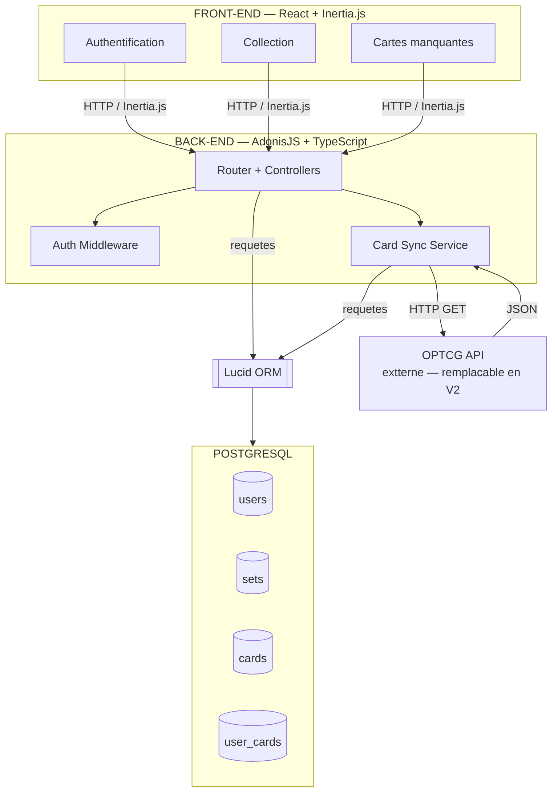
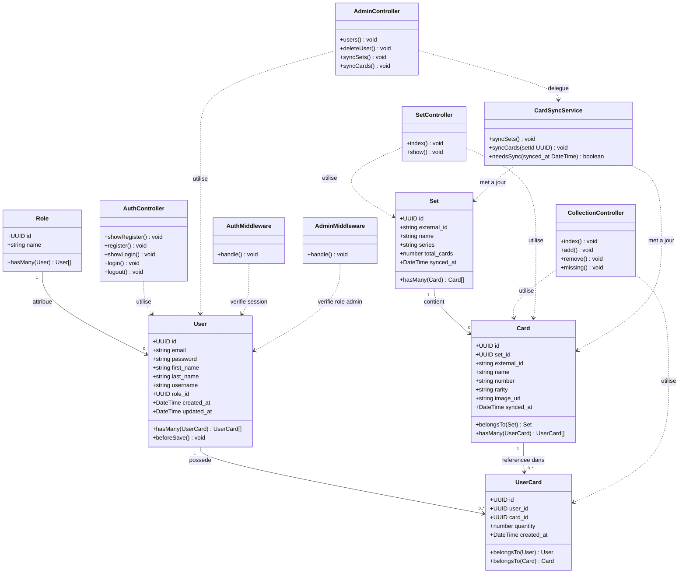
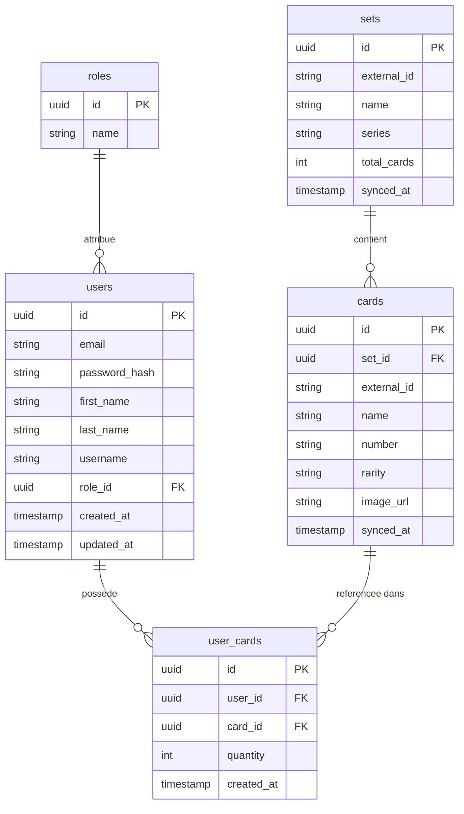
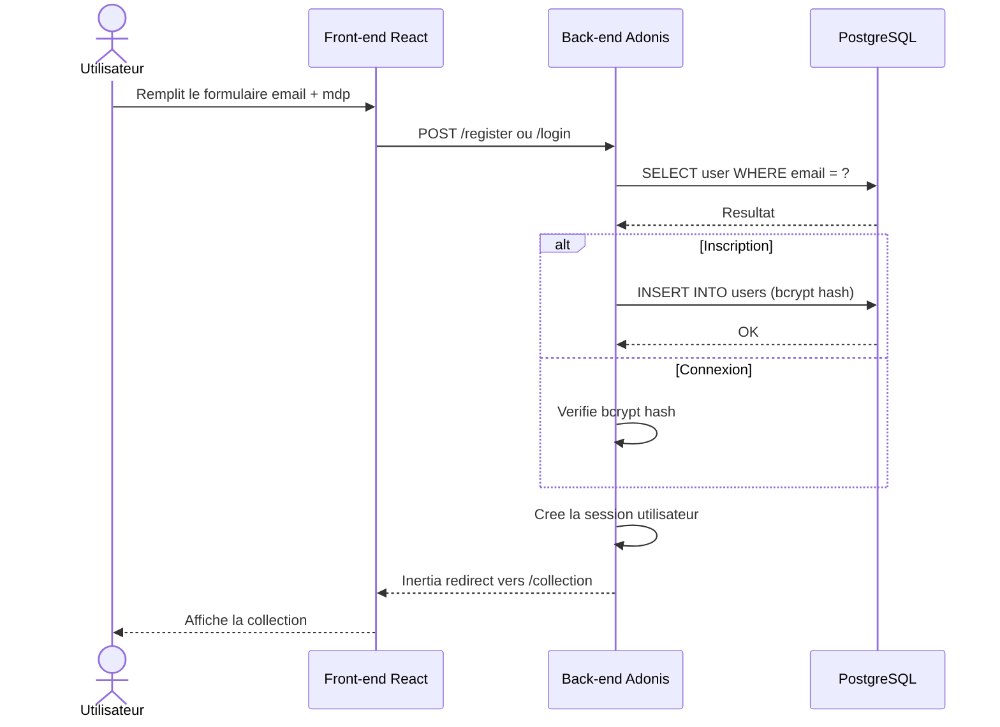
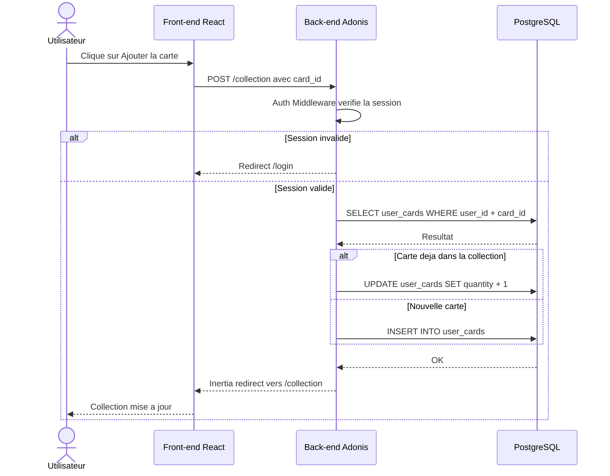
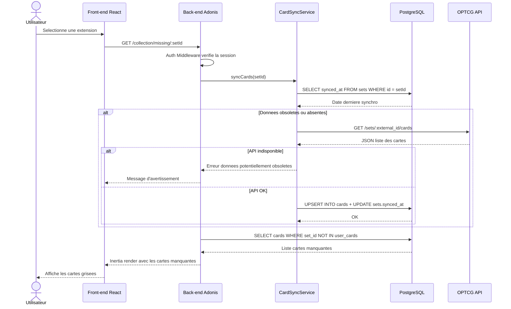
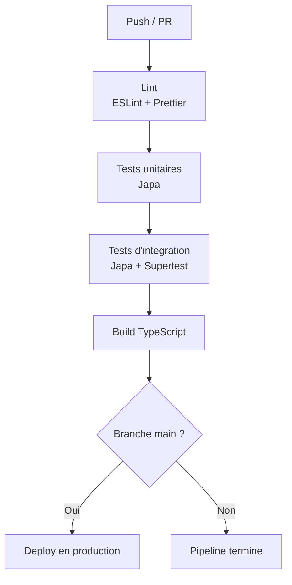

# TopCard — Documentation Technique MVP

> Application web de gestion de collection de cartes **One Piece Card Game**.
> Developpement solo — Stack : AdonisJS · TypeScript · Inertia.js · React · PostgreSQL · Lucid ORM

---

## Table des matieres

1. [User Stories](#1-user-stories)
2. [Mockups](#2-mockups)
3. [Architecture systeme](#3-architecture-systeme)
4. [Components, Classes et Base de donnees](#4-components-classes-et-base-de-donnees)
5. [Diagrammes de sequence](#5-diagrammes-de-sequence)
6. [Specifications API](#6-specifications-api)
7. [SCM et QA](#7-scm-et-qa)
8. [Justifications techniques](#8-justifications-techniques)

---

## 1. User Stories

> Priorisation : methode **MoSCoW** (Must · Should · Could · Won't).

### Roles utilisateurs

| Role | Description |
|------|-------------|
| Visiteur | Utilisateur non authentifie, acces limite aux pages publiques |
| Collectionneur | Utilisateur inscrit et authentifie, acces a sa collection et aux fonctionnalites de suivi |
| Admin | Utilisateur avec le role `admin`, acces aux routes d'administration et de synchronisation |

---

### Authentification

| ID | User Story | Priorite |
|----|-----------|----------|
| AUTH-01 | En tant que visiteur, je veux creer un compte avec un email et un mot de passe, afin de pouvoir gerer ma propre collection. | Must Have |
| AUTH-02 | En tant que collectionneur, je veux me connecter a mon compte, afin d'acceder a ma collection personnelle. | Must Have |
| AUTH-03 | En tant que collectionneur, je veux me deconnecter, afin de securiser l'acces a mon compte. | Must Have |
| AUTH-04 | En tant que visiteur, je veux recevoir un message d'erreur explicite si mes identifiants sont incorrects, afin de comprendre pourquoi ma connexion echoue. | Should Have |

### Gestion de la collection

| ID | User Story | Priorite |
|----|-----------|----------|
| COLL-01 | En tant que collectionneur, je veux rechercher une carte par son nom ou son numero, afin de la retrouver rapidement dans la base. | Must Have |
| COLL-02 | En tant que collectionneur, je veux ajouter une carte a ma collection, afin de la referencer comme possedee. | Must Have |
| COLL-03 | En tant que collectionneur, je veux indiquer la quantite d'exemplaires d'une carte, afin de refleter fidelement mes doublons. | Must Have |
| COLL-04 | En tant que collectionneur, je veux supprimer une carte de ma collection, afin de corriger une erreur ou un retrait. | Must Have |
| COLL-05 | En tant que collectionneur, je veux consulter la liste complete de ma collection, afin d'avoir une vue d'ensemble de mes cartes. | Must Have |
| COLL-06 | En tant que collectionneur, je veux filtrer ma collection par extension, afin de me concentrer sur un set en particulier. | Should Have |

### Cartes manquantes

| ID | User Story | Priorite |
|----|-----------|----------|
| MISS-01 | En tant que collectionneur, je veux selectionner une extension, afin de cibler le set sur lequel je souhaite travailler. | Must Have |
| MISS-02 | En tant que collectionneur, je veux voir la liste des cartes qui me manquent dans une extension, afin de savoir lesquelles chercher. | Must Have |
| MISS-03 | En tant que collectionneur, je veux voir le pourcentage de completion d'une extension, afin de mesurer ma progression. | Should Have |
| MISS-04 | En tant que collectionneur, je veux exporter la liste des cartes manquantes, afin de l'utiliser hors application. | Could Have |

### Synchronisation API externe

| ID | User Story | Priorite |
|----|-----------|----------|
| SYNC-01 | En tant que collectionneur, je veux que les donnees d'extensions et de cartes soient a jour via l'API externe, afin de disposer du catalogue officiel le plus recent. | Must Have |
| SYNC-02 | En tant que collectionneur, je veux recevoir un message d'erreur clair si la recuperation des donnees echoue, afin de comprendre l'indisponibilite et de reessayer plus tard. | Should Have |

### Hors scope V1 (Won't Have)

| ID | User Story | Raison du report |
|----|-----------|-----------------|
| OUT-01 | Consulter la cote de mes cartes | Reporte en V2 — necessite une source de cotation fiable |
| OUT-02 | Proposer des echanges a d'autres utilisateurs | Reporte en V3 — implique une dimension sociale et de moderation |
| OUT-03 | Consulter une page des evenements boutiques | Reporte en V2/V3 — depend d'un partenariat boutiques |

### Recapitulatif MoSCoW

| Priorite | Nombre de stories |
|----------|-------------------|
| Must Have | 11 |
| Should Have | 4 |
| Could Have | 1 |
| Won't Have (V1) | 3 |
| **Total** | **19** |

---

## 2. Mockups

### Ecrans concernes

| Ecran | Desktop | Mobile |
|-------|---------|--------|
| Page inscription / connexion | `mockups/desktop/01_auth.png` | `mockups/mobile/01_auth.png` |
| Page d'accueil | `mockups/desktop/02_home.png` | `mockups/mobile/02_home.png` |
| Dashboard — Ma collection | `mockups/desktop/03_collection.png` | `mockups/mobile/03_collection.png` |
| Detail d'une carte | `mockups/desktop/04_detail-card.png` | `mockups/mobile/04_detail-card.png` |
| Profil & Statistiques | `mockups/desktop/05_profil&stats.png` | `mockups/mobile/05_profil&stats.png` |

> **Convention de grisage :** toute carte non possedee par l'utilisateur est affichee avec une opacite reduite et un overlay gris. Les cartes possedees sont affichees normalement.

---

## 3. Architecture systeme

### Diagramme haut niveau



### Flux principal

`Utilisateur > React (Inertia) > Router > [Auth Middleware | Card Sync Service] > Lucid ORM > PostgreSQL`

Le Card Sync Service peut en complement declencher un appel sortant vers l'OPTCG API pour rafraichir le catalogue avant de repondre.

---

## 4. Components, Classes et Base de donnees

### 4.1 Models (Lucid ORM)

#### User

| Attribut | Type | Description |
|----------|------|-------------|
| id | uuid PK | Cle primaire |
| email | string | Adresse email unique |
| password | string | Hash bcrypt |
| first_name | string | Prenom de l'utilisateur |
| last_name | string | Nom de l'utilisateur |
| username | string | Pseudo unique de l'utilisateur |
| role_id | uuid FK | Cle etrangere vers Role (default : user) |
| created_at | DateTime | Date de creation |
| updated_at | DateTime | Date de mise a jour |

Methodes : `hasMany(UserCard)`, `belongsTo(Role)`, `beforeSave()` hook bcrypt

#### Role

| Attribut | Type | Description |
|----------|------|-------------|
| id | uuid PK | Cle primaire |
| name | string | Nom du role (admin, user, pro) |

Methodes : `hasMany(User)`

---

#### Set (Extension)

| Attribut | Type | Description |
|----------|------|-------------|
| id | uuid PK | Cle primaire |
| external_id | string | Identifiant cote OPTCG API |
| name | string | Nom de l'extension |
| series | string | Serie parente |
| total_cards | number | Nombre total de cartes |
| synced_at | DateTime | Derniere synchronisation API |

Methodes : `hasMany(Card)`

#### Card

| Attribut | Type | Description |
|----------|------|-------------|
| id | uuid PK | Cle primaire |
| set_id | uuid FK | Cle etrangere vers Set |
| external_id | string | Identifiant cote OPTCG API |
| name | string | Nom de la carte |
| number | string | Numero dans l'extension |
| rarity | string | Rarete |
| image_url | string | URL de l'image (cache) |
| synced_at | DateTime | Derniere synchronisation API |

Methodes : `belongsTo(Set)`, `hasMany(UserCard)`

#### UserCard

| Attribut | Type | Description |
|----------|------|-------------|
| id | uuid PK | Cle primaire |
| user_id | uuid FK | Cle etrangere vers User |
| card_id | uuid FK | Cle etrangere vers Card |
| quantity | number | Nombre d'exemplaires possedes |
| created_at | DateTime | Date d'ajout |

Methodes : `belongsTo(User)`, `belongsTo(Card)`

---

### 4.2 Controllers

| Controller | Methode | Route | Description |
|------------|---------|-------|-------------|
| AuthController | `showRegister()` | GET /register | Formulaire inscription |
| AuthController | `register()` | POST /register | Cree le compte |
| AuthController | `showLogin()` | GET /login | Formulaire connexion |
| AuthController | `login()` | POST /login | Authentifie via session |
| AuthController | `logout()` | POST /logout | Detruit la session |
| CollectionController | `index()` | GET /collection | Liste la collection |
| CollectionController | `add()` | POST /collection | Ajoute une carte |
| CollectionController | `remove()` | DELETE /collection/:id | Supprime une carte |
| CollectionController | `missing()` | GET /collection/missing/:setId | Cartes manquantes |
| SetController | `index()` | GET /sets | Liste les extensions |
| SetController | `show()` | GET /sets/:id | Detail d'une extension |
| AdminController | `users()` | GET /admin/users | Liste les utilisateurs |
| AdminController | `deleteUser()` | DELETE /admin/users/:id | Supprime un utilisateur |
| AdminController | `syncSets()` | POST /admin/sync/sets | Synchronise les extensions |
| AdminController | `syncCards()` | POST /admin/sync/cards/:setId | Synchronise une extension |

---

### 4.3 Services et Middleware

#### CardSyncService

| Methode | Description |
|---------|-------------|
| `syncSets()` | Recupere les extensions depuis l'OPTCG API et met a jour `sets` |
| `syncCards(setId)` | Recupere les cartes d'une extension et met a jour `cards` |
| `needsSync(synced_at)` | Retourne true si les donnees sont obsoletes ou absentes |

#### AuthMiddleware

| Methode | Description |
|---------|-------------|
| `handle()` | Verifie la session active, redirige vers /login sinon |

#### AdminMiddleware

| Methode | Description |
|---------|-------------|
| `handle()` | Verifie que `user.role.name === 'admin'`, retourne 403 sinon |

---

### 4.4 Diagramme de classes



**Legende — Diagramme de classes**

| Symbole | Signification |
|---------|--------------|
| `+` | Attribut ou methode public (accessible depuis l'exterieur) |
| Fleche pleine `-->` | Relation directe — une classe possede ou est liee a une autre |
| `"1" --> "0..*"` | Cardinalite — 1 element est lie a 0 ou plusieurs elements |
| Fleche pointillee `..>` | Dependance — une classe utilise une autre sans la posseder |
| Models (`User`, `Set`, `Card`, `UserCard`) | Representent les tables PostgreSQL et leurs relations |
| Controllers | Gerent les routes et la logique de traitement des requetes |
| Services (`CardSyncService`) | Encapsulent la logique metier complexe (sync API, cache) |
| Middlewares | Interceptent les requetes pour verifier les permissions avant le controller |

---

### 4.5 ERD — Base de donnees



**Legende — ERD**

| Symbole | Signification |
|---------|--------------|
| `PK` | Primary Key — identifiant unique de chaque ligne dans la table |
| `FK` | Foreign Key — champ qui pointe vers le PK d'une autre table, cree le lien entre tables |
| `||--o{` | Relation 1 a N — un enregistrement d'un cote est lie a 0 ou plusieurs de l'autre |
| `uuid` | Identifiant unique universel, utilise comme cle primaire |
| `timestamp` | Date et heure de creation ou de mise a jour |
| `external_id` | Identifiant cote OPTCG API — permet de changer d'API sans modifier le schema |
| `synced_at` | Date de derniere synchronisation avec l'API externe, utilise pour la logique de cache |
| Table `user_cards` | Table de jointure entre `users` et `cards` — represente la collection d'un utilisateur |
| Contrainte `UNIQUE (user_id, card_id)` | Empeche qu'une meme carte apparaisse deux fois dans la collection — on incremente `quantity` a la place |

**Notation des relations (cardinalites) :**

| Notation | Lecture | Signification |
|----------|---------|--------------|
| \|\| | un et un seul | Exactement 1 element |
| o{ | zero ou plusieurs | 0 a N elements |
| \|\|--o{ | un a plusieurs | 1 element est lie a 0 ou plusieurs |

### Schema SQL

```sql
CREATE TABLE roles (
  id    UUID PRIMARY KEY DEFAULT gen_random_uuid(),
  name  VARCHAR(50) NOT NULL UNIQUE
);

CREATE TABLE users (
  id          UUID PRIMARY KEY DEFAULT gen_random_uuid(),
  email       VARCHAR(255) NOT NULL UNIQUE,
  password    VARCHAR(255) NOT NULL,
  first_name  VARCHAR(100) NOT NULL,
  last_name   VARCHAR(100) NOT NULL,
  username    VARCHAR(50) NOT NULL UNIQUE,
  role_id     UUID NOT NULL REFERENCES roles(id),
  created_at  TIMESTAMP NOT NULL DEFAULT NOW(),
  updated_at  TIMESTAMP NOT NULL DEFAULT NOW()
);

CREATE TABLE sets (
  id           UUID PRIMARY KEY DEFAULT gen_random_uuid(),
  external_id  VARCHAR(100) NOT NULL UNIQUE,
  name         VARCHAR(255) NOT NULL,
  series       VARCHAR(255),
  total_cards  INTEGER NOT NULL DEFAULT 0,
  synced_at    TIMESTAMP
);

CREATE TABLE cards (
  id           UUID PRIMARY KEY DEFAULT gen_random_uuid(),
  set_id       UUID NOT NULL REFERENCES sets(id) ON DELETE CASCADE,
  external_id  VARCHAR(100) NOT NULL UNIQUE,
  name         VARCHAR(255) NOT NULL,
  number       VARCHAR(20),
  rarity       VARCHAR(50),
  image_url    TEXT,
  synced_at    TIMESTAMP
);

CREATE TABLE user_cards (
  id          UUID PRIMARY KEY DEFAULT gen_random_uuid(),
  user_id     UUID NOT NULL REFERENCES users(id) ON DELETE CASCADE,
  card_id     UUID NOT NULL REFERENCES cards(id) ON DELETE CASCADE,
  quantity    INTEGER NOT NULL DEFAULT 1,
  created_at  TIMESTAMP NOT NULL DEFAULT NOW(),
  UNIQUE (user_id, card_id)
);
```

---

### 4.6 Composants React

| Composant | Props | Description |
|-----------|-------|-------------|
| `Layout` | children | Enveloppe globale incluant Navbar |
| `Navbar` | user | Navigation + indicateur utilisateur connecte |
| `LoginPage` | errors | Formulaire de connexion |
| `RegisterPage` | errors | Formulaire d'inscription (email, mot de passe, prenom, nom, pseudo) |
| `CollectionPage` | cards, sets | Liste cartes, recherche, filtre |
| `SetPage` | set, cards, user_cards, completion_pct | Grille avec grisage des manquantes |
| `MissingPage` | set, missing_cards, completion_pct | Cartes manquantes grisees |
| `CardGrid` | cards, userCards | Grille de vignettes |
| `CardThumbnail` | card, owned, quantity | Vignette — grisee si owned = false |
| `ProgressBar` | total, owned | Barre de completion d'une extension |
| `SearchBar` | onSearch | Champ recherche avec debounce |
| `SetSelector` | sets, onSelect | Menu deroulant d'extension |
| `AddCardButton` | cardId, onAdd | Ajout a la collection |
| `RemoveCardButton` | userCardId, onRemove | Suppression de la collection |

---

## 5. Diagrammes de sequence

### 5.1 Inscription / Connexion



---

### 5.2 Ajout d'une carte a la collection



---

### 5.3 Chargement des cartes manquantes



---

## 6. Specifications API

### 6.1 API externe — OPTCG API

| Champ | Detail |
|-------|--------|
| URL de base | `https://www.optcgapi.com/` |
| Protocole | HTTPS / REST |
| Format | JSON |
| Authentification | Aucune (API publique gratuite) |
| Utilisation | Recuperation des extensions et des cartes par extension |

**Endpoints utilises :**

| Methode | Endpoint | Description |
|---------|----------|-------------|
| GET | `/sets` | Liste toutes les extensions disponibles |
| GET | `/sets/:external_id/cards` | Liste toutes les cartes d'une extension |

**Limites du plan gratuit :**
L'API est publique et ne necessite pas de cle. Les options payantes (cotation, historique de prix, enrichissement avance) sont hors scope V1. En cas d'indisponibilite, l'application continue de fonctionner sur les donnees en cache grace au champ `synced_at`.

**Risque :** dependance a une API tierce non officielle. Le champ `external_id` sur les tables `sets` et `cards` permet de brancher une API de remplacement en V2 sans modifier le schema.

---

### 6.2 Routes internes — Adonis + Inertia

> Ces routes ne retournent pas du JSON brut. Elles retournent une page React via Inertia (requetes navigateur) ou du JSON partiel via Inertia (requetes XHR). La colonne "Equivalent REST" indique ce que retournerait la route si elle etait exposee en API pure.

#### Authentification

| Methode | Route | Auth | Input | Retour Inertia | Equivalent REST | Erreurs |
|---------|-------|------|-------|----------------|-----------------|---------|
| POST | `/register` | Non | `{ email, password, first_name, last_name, username }` | Redirect /collection | `201` + `{ id, email, created_at }` | `422` champs invalides — role `user` attribue par defaut |
| POST | `/login` | Non | `{ email, password }` | Redirect /collection | `200` + `{ id, email }` | `401` identifiants incorrects |
| POST | `/logout` | Oui | Aucun | Redirect /login | `204 No Content` | — |

#### Collection

| Methode | Route | Auth | Input | Retour Inertia | Equivalent REST | Erreurs |
|---------|-------|------|-------|----------------|-----------------|---------|
| GET | `/collection` | Oui | `?search&set_id` | Page CollectionPage | `200` + `{ cards[] }` | — |
| POST | `/collection` | Oui | `{ card_id }` | Redirect /collection | `200` + `{ user_card }` | `404` `422` |
| DELETE | `/collection/:id` | Oui | `:id` uuid user_card | Redirect /collection | `204 No Content` | `403` `404` |
| GET | `/collection/missing/:setId` | Oui | `:setId` uuid | Page MissingPage | `200` + `{ set, missing_cards[], completion_pct }` | `404` |

#### Extensions

| Methode | Route | Auth | Input | Retour Inertia | Equivalent REST | Erreurs |
|---------|-------|------|-------|----------------|-----------------|---------|
| GET | `/sets` | Oui | Aucun | Page SetsPage | `200` + `{ sets[] }` | — |
| GET | `/sets/:id` | Oui | `:id` uuid | Page SetPage | `200` + `{ set, cards[], completion_pct }` | `404` |

#### Admin

> Routes protegees par `AuthMiddleware` + `AdminMiddleware` (role `admin` requis).

| Methode | Route | Auth | Input | Retour Inertia | Equivalent REST | Erreurs |
|---------|-------|------|-------|----------------|-----------------|---------|
| GET | `/admin/users` | Admin | Aucun | Page AdminUsersPage | `200` + `{ users[] }` | — |
| DELETE | `/admin/users/:id` | Admin | `:id` uuid user | Redirect /admin/users | `204 No Content` | `403` `404` |
| POST | `/admin/sync/sets` | Admin | Aucun | Redirect /admin/sync | `200` + `{ synced_sets, errors[] }` | `502` |
| POST | `/admin/sync/cards/:setId` | Admin | `:setId` uuid | Redirect /admin/sync | `200` + `{ synced_cards, set_id, errors[] }` | `404` `502` |

#### Recapitulatif des routes

| Methode | Route | Auth | Description |
|---------|-------|------|-------------|
| POST | `/register` | Non | Inscription |
| POST | `/login` | Non | Connexion |
| POST | `/logout` | Oui | Deconnexion |
| GET | `/collection` | Oui | Liste la collection |
| POST | `/collection` | Oui | Ajoute une carte |
| DELETE | `/collection/:id` | Oui | Supprime une carte |
| GET | `/collection/missing/:setId` | Oui | Cartes manquantes |
| GET | `/sets` | Oui | Liste les extensions |
| GET | `/sets/:id` | Oui | Detail d'une extension |
| GET | `/admin/users` | Admin | Liste les utilisateurs |
| DELETE | `/admin/users/:id` | Admin | Supprime un utilisateur |
| POST | `/admin/sync/sets` | Admin | Synchronise les extensions |
| POST | `/admin/sync/cards/:setId` | Admin | Synchronise une extension |

---

## 7. SCM et QA

### 7.1 Gestion du code source (SCM)

| Outil | Utilisation |
|-------|-------------|
| Git | Versioning local |
| GitHub | Hebergement, branches, pull requests |

#### Strategie de branches

```
main
 └── develop
      ├── feature/auth
      ├── feature/collection
      ├── feature/missing-cards
      ├── feature/card-sync
      ├── feature/admin
      └── fix/nom-du-bug
```

| Branche | Role | Regles |
|---------|------|--------|
| `main` | Code stable en production | Jamais de commit direct — merge via PR uniquement |
| `develop` | Integration continue | Merge des branches `feature/*` apres validation |
| `feature/*` | Developpement d'une fonctionnalite | Une branche par user story ou groupe lie |
| `fix/*` | Correction de bug | Creee depuis `develop`, mergee dans `develop` |

#### Conventions de commit

Format : `type(scope): description courte`

| Type | Usage |
|------|-------|
| `feat` | Nouvelle fonctionnalite |
| `fix` | Correction de bug |
| `chore` | Tache technique (config, deps) |
| `refactor` | Refactorisation sans changement de comportement |
| `test` | Ajout ou modification de tests |
| `docs` | Documentation |

#### Checklist PR (develop > main)

- Les tests passent
- Aucune regression sur les routes existantes
- Le fichier `.env.example` est a jour
- La migration est incluse si le schema a change

---

### 7.2 Strategie de tests (QA)

| Outil | Type | Usage |
|-------|------|-------|
| Japa (natif Adonis) | Tests unitaires et integration | Services, controllers, middlewares |
| Supertest | Tests HTTP | Simulation de requetes sur les routes |
| Postman | Tests manuels | Routes admin, flux critiques, sync API |
| ESLint + Prettier | Qualite du code | Linting TypeScript, formatage |

#### Tests unitaires

| Cible | Scenario |
|-------|---------|
| `CardSyncService.needsSync()` | Retourne true si `synced_at` est trop ancien ou null |
| `CardSyncService.syncCards()` | Parse et insere correctement le JSON OPTCG API |
| `AuthController` | Hash bcrypt applique avant insertion |

#### Tests d'integration

| Route | Scenario |
|-------|---------|
| `POST /register` | Inscription valide, email deja utilise, champs manquants |
| `POST /login` | Connexion valide, mauvais mot de passe |
| `POST /collection` | Ajout nouvelle carte, increment quantite, carte inexistante |
| `DELETE /collection/:id` | Suppression valide, carte d'un autre utilisateur |
| `GET /collection/missing/:setId` | Retourne les bonnes cartes manquantes |
| `POST /admin/sync/sets` | Acces admin OK, acces user standard refuse |

#### Couverture cible MVP

| Couche | Objectif |
|--------|----------|
| Services (`CardSyncService`) | 80% de couverture |
| Controllers (routes critiques) | Tests d'integration sur les 5 routes principales |
| Middleware (`AuthMiddleware`, `AdminMiddleware`) | 100% des cas (acces autorise / refuse) |
| Front-end React | Tests manuels navigateur en V1 |

---

### 7.3 Pipeline CI/CD (GitHub Actions)



#### Environnements

| Environnement | Branche source | Usage |
|---------------|----------------|-------|
| Local | `feature/*` / `develop` | Developpement quotidien |
| Staging | `develop` | Recette avant mise en prod |
| Production | `main` | Version stable livree |

#### Variables d'environnement (.env.example)

```
APP_KEY=
DB_HOST=
DB_PORT=
DB_USER=
DB_PASSWORD=
DB_DATABASE=
OPTCG_API_URL=https://www.optcgapi.com/
SESSION_DRIVER=cookie
```

Les valeurs reelles sont stockees dans les secrets GitHub Actions et jamais committees.

---

## 8. Justifications techniques

| Choix | Justification |
|-------|--------------|
| **AdonisJS** | Framework TypeScript natif avec ORM (Lucid), auth, migrations et Inertia integres. Ideal pour un projet solo avec deadline — tout est configure par defaut. |
| **TypeScript** | Typage statique sur toute la codebase (front + back), reduces les erreurs runtime et ameliore la maintenabilite. |
| **Inertia.js** | Elimine le besoin d'une API REST separee. Le back-end renvoie directement les props des composants React — moins de code, moins de surface d'erreur. |
| **React** | Composants reutilisables adaptes a la grille de cartes et au grisage dynamique (`owned` prop sur `CardThumbnail`). |
| **Systeme de roles** | Table `roles` separee avec FK sur `users` — plus scalable qu'un boolean `is_admin`. Permet d'ajouter de nouveaux roles (moderator, premium...) en V2 sans modifier le schema. |
| **Lucid ORM** | ORM natif Adonis, integration complete avec l'auth, les migrations et les relations. Evite les frictions d'un ORM tiers (Prisma) dans l'ecosysteme Adonis. |
| **PostgreSQL** | Base relationnelle robuste, contrainte `UNIQUE (user_id, card_id)` sur `user_cards` evite les doublons sans logique applicative supplementaire. |
| **OPTCG API (plan gratuit)** | Seule API publique disponible pour le One Piece TCG. Le plan gratuit couvre les endpoints necessaires au MVP (sets + cards). Les options payantes (cotation) sont hors scope V1. Le champ `external_id` permet de changer d'API sans migration de schema. |
| **Japa** | Framework de test natif Adonis — pas de configuration supplementaire, integration directe avec la base de test. |
| **Git Flow simplifie** | Adapte au projet solo : deux branches stables (`main`, `develop`) + branches courtes par feature. Trace propre pour la soutenance. |
